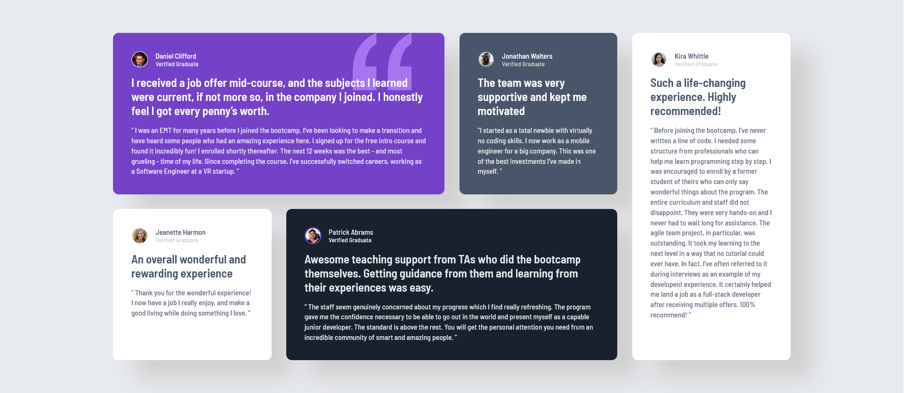

# Frontend Mentor - Testimonials grid section solution

This is a solution to the [Testimonials grid section challenge on Frontend Mentor](https://www.frontendmentor.io/challenges/testimonials-grid-section-Nnw6J7Un7). Frontend Mentor challenges help you improve your coding skills by building realistic projects. 

## Table of contents

- [Overview](#overview)
  - [The challenge](#the-challenge)
  - [Screenshot](#screenshot)
  - [Links](#links)
- [My process](#my-process)
  - [Built with](#built-with)
  - [Continued development](#continued-development)
- [Author](#author)

## Overview

### The challenge

Users should be able to:

- View the optimal layout for the site depending on their device's screen size

### Screenshot

### Links

- Solution URL: [https://katherin467.github.io/fm-testimonials-grid-section/]

## My process

### Built with

- Semantic HTML5 markup
- CSS media queries
- [Less](https://lesscss.org/)
- Flexbox
- CSS Grid
- Mobile-first workflow

### Continued development

I'd like to get more practice in using CSS grid! I used it for this project, but I'd like to get more practice with it. 

## Author

- Website - [Katherine Lim](https://katherin467.github.io/)
- Frontend Mentor - [@katherin467](https://www.frontendmentor.io/profile/katherin467)